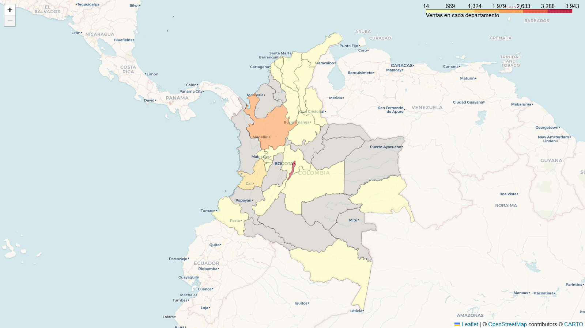

# Challenge Alura Store

Este proyecto presenta un análisis de los datos de ventas en las tiendas de 
Alura Store, la finalidad es decidir cuál tienda se venderá para iniciar un
nuevo emprendimiento.

## Descripción

Se analizó información sobre los ingresos, los productos vendidos, la 
satisfacción de los clientes, y en qué sectores se vendían más frecuentemente
los productos. Las métricas específicas fueron:

1. Ingresos totales en cada tienda.
2. Ventas de productos por categoría.
3. Calificación de los clientes.
4. Productos más vendidos y menos vendidos.
5. Costo de envío por tienda.
6. Sectores geográficos con más clientes.

La información fue sintetizada en visualizaciones basadas en los datos de las
tiendas, que apoyan al informe más adelante.

## ¿Cómo ejecutar?

Este proyecto se realizó con las siguientes herramientas

- **Pandas** para el análisis.
- **Matplotlib** para la visualización.
- **Geopandas, Folium** para la visualización geográfica.

### Google Colab

Colab tiene la mayoría de las librerías requeridas para este proyecto. En el 
notebook, ejecuta:
```bash
!pip install selenium
```
Para instalar Selenium Webdriver, usado por Folium para generar las imágenes
de los mapas.

### Local

Este proyecto fue ejecutado con **Python 3.13.9**, usando **conda**.
Para instalar las dependencias, crea un entorno virtual, y ejecuta:

```bash
pip install -r requirements.txt
```

## Informe

Se presentan los hallazgos obtenidos con base en los análisis realizados, 
utilizando las métricas definidas anteriormente.

### 1. Ingresos totales por tienda


Los ingresos totales muestran que todas las tiendas han generado una cantidad
considerable de ganancias, pero que, en proporción, la tienda 4 es la que
menos ha generado, con una diferencia mayor a 50 millones frente a las otras.

### 2. Ventas de productos por categoría


Los porcentajes de productos vendidos por categoría muestran que en todas las
tiendas más de un tercio de las ventas son en muebles y electrónicos, 
pero no se ilustra una diferencia pertinente para la decisión a tomar. 

### 3. Calificación de los clientes.


Los resultados nos permiten agrupar las tiendas en dos parejas:

- Las tiendas 2 y 3 con los mejores promedios.
- Las tiendas 1 y 4 con los peores promedios.

Se debe tener en cuenta que la diferencia de calificaciones en promedio no es
alta (menor a una décima de estrella), entonces, la opinión de los clientes, 
sin importar la tienda, debe ser parecida, con las tiendas 2 y 3 recibiendo 
ligeramente mejores reseñas.

### 4. Productos más vendidos y menos vendidos.


Los productos más vendidos nos dejan observar que, las categorías de 
productos que parecen tener precios más altos son los más vendidos en las 
tiendas con mayores ingresos, esto podría explicar la diferencia notable de 
ganancias entre las tiendas.


### 5. Costo de envío por tienda.


El costo de envío asociado a cada venta fue clasificado en rangos, para
definir cuáles tiendas tenían mayores costos al hacer las ventas, igualmente,
los resultados no muestran una diferencia mayor entre las tiendas; aunque la
tienda 4 tenga más envíos en el rango menor de precios, con el promedio se
puede observar que no hay una alta varianza.

Al ser un costo agregado al precio que paga el cliente, estas diferencias no
generan pérdidas para las tiendas.

### 6. Sectores geográficos con más clientes.

Al analizar la localización de las ventas, se halló que las ventas de todas
las tiendas han sido realizadas en Colombia. A partir de esto, se dividieron
los sectores por los departamentos del país para determinar la densidad de
compras por cada uno.



Los 3 departamentos y sus correspondientes ciudades, en los que se han
realizado más ventas entre todas las tiendas (más de la mitad del total de 
ventas), son:

| Ciudad   | Departamento    | Ventas |
|----------|-----------------|--------|
| Bogotá   | Bogotá D.C      | 3943   |
| Medellín | Antioquia       | 2314   |
| Cali     | Valle del Cauca | 1007   |

Más de la mitad de las ventas totales han sido hechas en estas ciudades

## Conclusión

Se debe considerar que no hay datos sobre factores externos a las 
ventas (*e.g.:* costos de almacenamiento, importe, transporte, tasas de 
interés en créditos, ofertas, descuentos, etc.), entonces, la decisión final
se tomó con base en los datos otorgados.

Los ingresos son la métrica obtenida que da mayor diferencia entre las tiendas
y deben ser un factor importante para el crecimiento de Alura Store, y debido
a la falta de diferencias notables en los otros factores calculados, la tienda
que se debe vender es la **tienda 4**.

